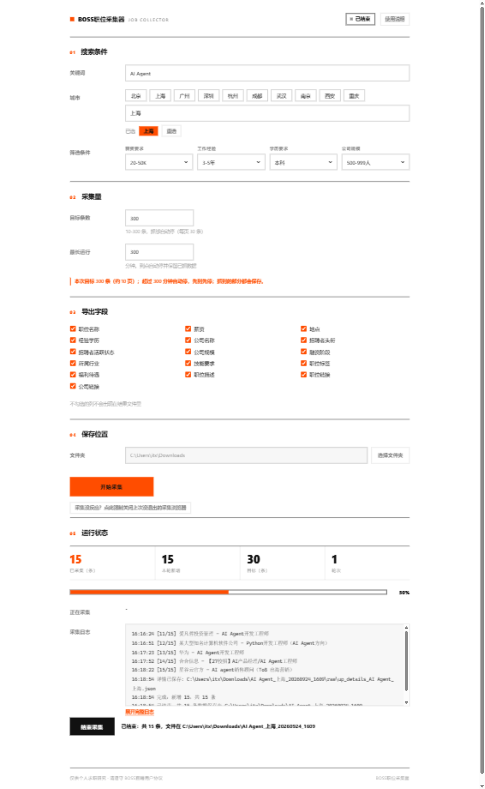
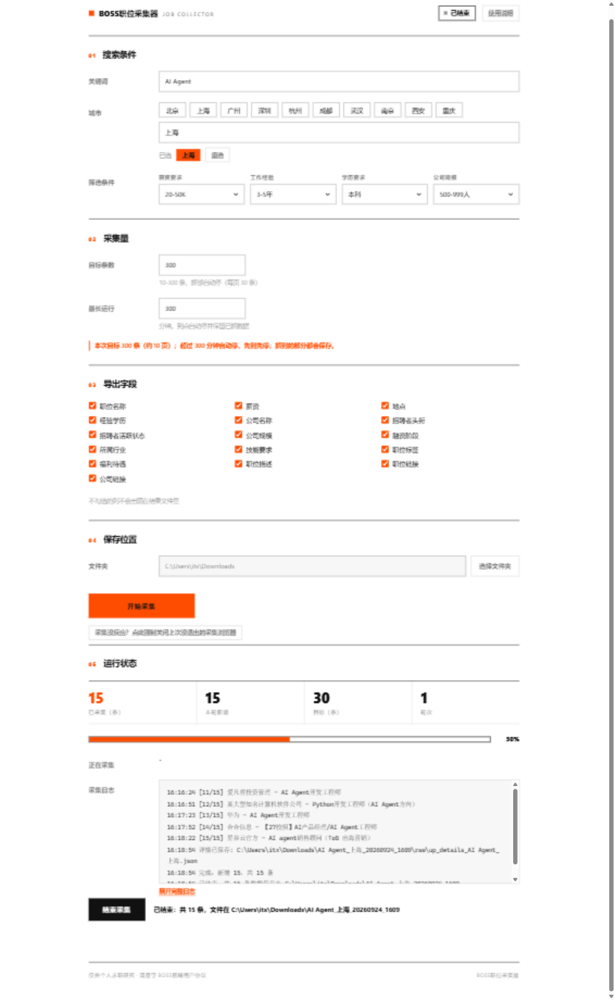
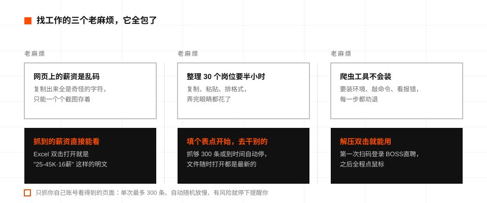
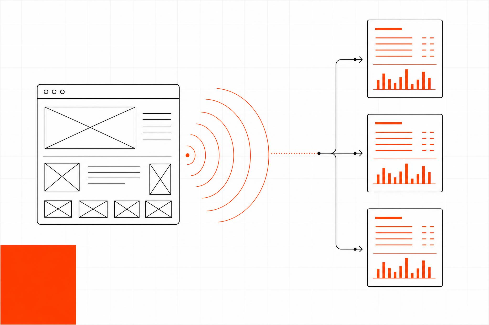

<div align="center">

# BOSS职位采集器

**填个表就能抓 BOSS直聘，数据直接喂给 AI。**

给完全不懂技术的求职者做的 Windows 小工具：关键词、城市、薪资一填，点开始，职位数据（含明文薪资和职位描述）自动落成规整的 JSON 和 Excel。

[](LICENSE)
[](#-快速开始)
[](#-更新计划)
[](#-它帮你做了什么)

中文 ｜ 上游引擎文档见 [docs/engine-README.md](docs/engine-README.md)


</div>

---

> [!IMPORTANT]
> **仅供个人求职研究。** 本工具抓的是你自己账号看得到的页面，频率限制写死在程序里：单次最多 300 条、翻页随机等待 12 到 22 秒、一次只跑一组条件。请遵守 [BOSS直聘用户协议](https://www.zhipin.com/about/protocol.html)，不要商用或转售数据。

## 🎯 为什么做这个

找工作的时候我想让 AI 帮我分析岗位：薪资分布长什么样、哪些技能要求最集中、我的简历缺哪些关键词。思路很顺，卡在数据上：

网页上的薪资是加密字体，直接复制出来是乱码；一页页手动粘贴，30 个岗位就要半小时；开源爬虫倒是能解决，可它们全是命令行工具，装 Python、敲参数、看报错，每一步都劝退普通人。

这个项目把 [boss-zhipin-scraper](https://github.com/eatmoreduck/boss-zhipin-scraper)（一个质量很高的 Chrome CDP 爬虫）包成了一个双击就能用的图形程序。爬虫内核一行没改，外面套了界面、任务管理和文件导出，让它从"程序员工具"变成"求职者工具"。

| | 手动复制粘贴 | 命令行爬虫 | BOSS职位采集器 |
|---|---|---|---|
| 上手门槛 | 人人都会 | 要会装环境、敲命令 | 双击图标，填表开始 |
| 薪资数据 | 乱码（字体加密） | ✅ 明文 | ✅ 明文 |
| 一次采集 | 30 个岗位半小时 | 自己拼命令 | 一组关键词 + 一个城市，抓够自动停 |
| 数据交给 AI | 一页页贴 | 自己写脚本转 | 拖一个 json 文件进对话框 |
| 账号安全 | 无风险 | 看实现 | 隔离浏览器 + 频率硬限制 |

## 📸 产品实拍

| 首页：填条件、勾字段，运行状态在页面底部 | 采集结束：条数、进度、日志同屏 |
|---|---|
|  |  |

界面是瑞士平面风格的：纸白底、近黑文字、一个国际橙强调色，没有花哨装饰。运行状态不打弹窗也不跳页，就待在你填写的内容下面。

## 🧰 它帮你做了什么



总结一下：你只要提供关键词和城市，"打开网页、翻页、等加载、把数据存成表格"这些重复劳动它全包办，抓到的薪资和职位描述直接是能读的文本，随手就能拖给 AI。

好奇明文薪资怎么来的？一句话：网页上的薪资是加密字体，复制出来才变乱码；但页面往后台传数据时用的是明文，程序做的只是旁听这些后台数据。它从不伪造、不重放任何请求，也不碰加密解密。



<div align="center"><sub>想看更细的可交互原理图：[docs/diagram](docs/diagram/boss-zhipin-scraper-explained.html)（浏览器打开，可点节点追踪数据流）</sub></div>

<br>

登录用的专用浏览器和你日常浏览器完全隔离：在里面登录一次 BOSS直聘长期有效，你日常浏览器里的 Gmail、GitHub、支付宝它一概碰不到。

## 🚀 快速开始

**方式一：下载现成的（推荐小白）**

到 [Releases](../../releases) 下载 `BOSS-Collector-v1.3.0.zip`，解压到桌面，双击「启动职位采集器」。第一次运行如果弹出蓝色警告，点「更多信息 → 仍要运行」；杀毒软件误报就把文件夹加入白名单（说明文档里有截图步骤）。

**方式二：从源码跑**

```bash
git clone https://github.com/August06exe/boss-zhipin-collector.git
cd boss-zhipin-collector
pip install -r requirements.txt -r gui/requirements-dev.txt
python gui/app/server.py
```

**第一次使用**：点开始后程序会弹出一个专用浏览器，在里面扫码登录 BOSS直聘，回到界面点「我登录好了」。登录一次长期有效。

**同时只运行一份**：程序全局只跑一个实例。双击另一份副本时，如果旧实例空闲会自动接管服务；如果旧实例正在采集，则不打断，直接帮你打开正在运行的那个界面。

**什么时候停**：抓够目标条数（默认 300，上限也是 300），或者到达最长运行时间，先到哪个听哪个。中途想停，点「结束采集」，已抓到的部分照常保存。

## 📖 数据文件：给 AI 的一步到位用法

每次采集生成一个独立文件夹（默认在「下载」里），三个文件各司其职：

```
AI Agent_上海_20260924_0258/
├─ jobs.json     ← 给 AI 的：规整职位数组，字段名自解释
├─ jobs.csv      ← 给你和 Excel 的：中文表头，双击不乱码
├─ meta.json     ← 任务说明书：搜了什么、筛了什么、什么时候抓的
└─ raw/          ← 原始全字段数据（改字段勾选不用重爬）
```

把 `jobs.json` 拖进任意 AI 对话框，配这句话：

> 这是一份 BOSS直聘职位数据（附带 meta.json 说明）。请分析：1. 薪资分布和常见档位；2. 出现频率最高的技能要求；3. 对照我的简历，列出需要补齐的关键词。

想换一批数据，改个关键词再跑一次就行，每次采集独立成文件夹，互不掺和。

## 🛡️ 安全与边界

- 界面服务只监听本机（127.0.0.1）+ 随机令牌，别的设备连不上，本机其他网页也调不动
- 专用浏览器与你主浏览器的数据完全隔离；不需要时点「强制关闭采集浏览器」即可
- 防风控是硬约束写死在程序里：单次最多 10 页 300 条、翻页随机等待、触发风控立即停下并提示你人工处理，绝不假装没事继续跑
- 采集浏览器卡死不响应？界面底部有救援按钮，一键强制清场

## 📍 更新计划

- [ ] 多任务队列（一次配好几组条件排队跑）
- [ ] macOS 版

明确不做：简历匹配打分、薪酬趋势预测这类分析功能。数据抓下来，分析交给 AI。

## 🤝 参与

Issue 和 PR 都欢迎。改引擎（scripts/）前先读 [docs/engine-README.md](docs/engine-README.md) 和 [CONTRIBUTING.md](CONTRIBUTING.md)；图形界面的改动在 gui/ 下，跑 `python -m pytest gui/tests` 过了再提。

## 🙏 致谢

- [eatmoreduck/boss-zhipin-scraper](https://github.com/eatmoreduck/boss-zhipin-scraper) —— 抓取内核的全部来源，本项目是它的图形化发行版，引擎代码（scripts/）原样保留
- [LINUX DO](https://linux.do/) —— 上游作者认可的技术社区

## 📄 协议

MIT。引擎部分版权归 eatmoreduck，图形界面部分归本项目作者，详见 [LICENSE](LICENSE)。

<div align="center">

<sub>一个不写代码的求职者，和一个读所有代码的 AI，一起造的。</sub>

</div>
